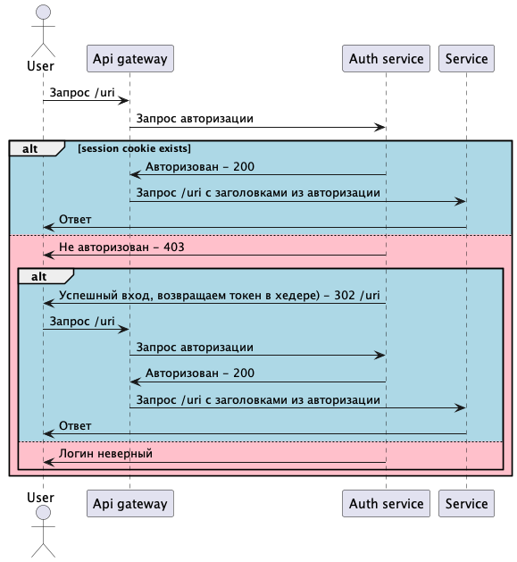

kubectl create namespace m

Манифесты
https://github.com/dbelokursky/microservice/tree/main/task06_1/manifests

kubectl apply -f secret.yml -n m
kubectl apply -f config-map.yml -n m
kubectl apply -f deployment.yml -n m
kubectl apply -f service.yml -n m
kubectl apply -f ingress.yml -n m
kubectl apply -f postgres-pv.yml -n m
kubectl apply -f postgres-pvc.yml -n m

helm repo add ingress-nginx https://kubernetes.github.io/ingress-nginx/ \
&& helm repo add bitnami https://charts.bitnami.com/bitnami \
&& helm repo update \
&& helm install nginx ingress-nginx/ingress-nginx -n m -f nginx-ingress-controller.yml \
&& helm install psql bitnami/postgresql -n m \
--set persistence.existingClaim=postgres-pvc \
--set volumePermissions.enabled=true \
--set auth.username=user_pg \
--set auth.password=pass_pg \
--set auth.database=user_db

Манифесты:
https://github.com/dbelokursky/microservice/tree/main/task06_2/manifests

kubectl apply -f config-map.yml -n m
kubectl apply -f deployment.yml -n m
kubectl apply -f service.yml -n m
kubectl apply -f routes.yml -n m

